# 手写字模拟器 — 完整渲染链路数据流图

## 一、全局数据流总览

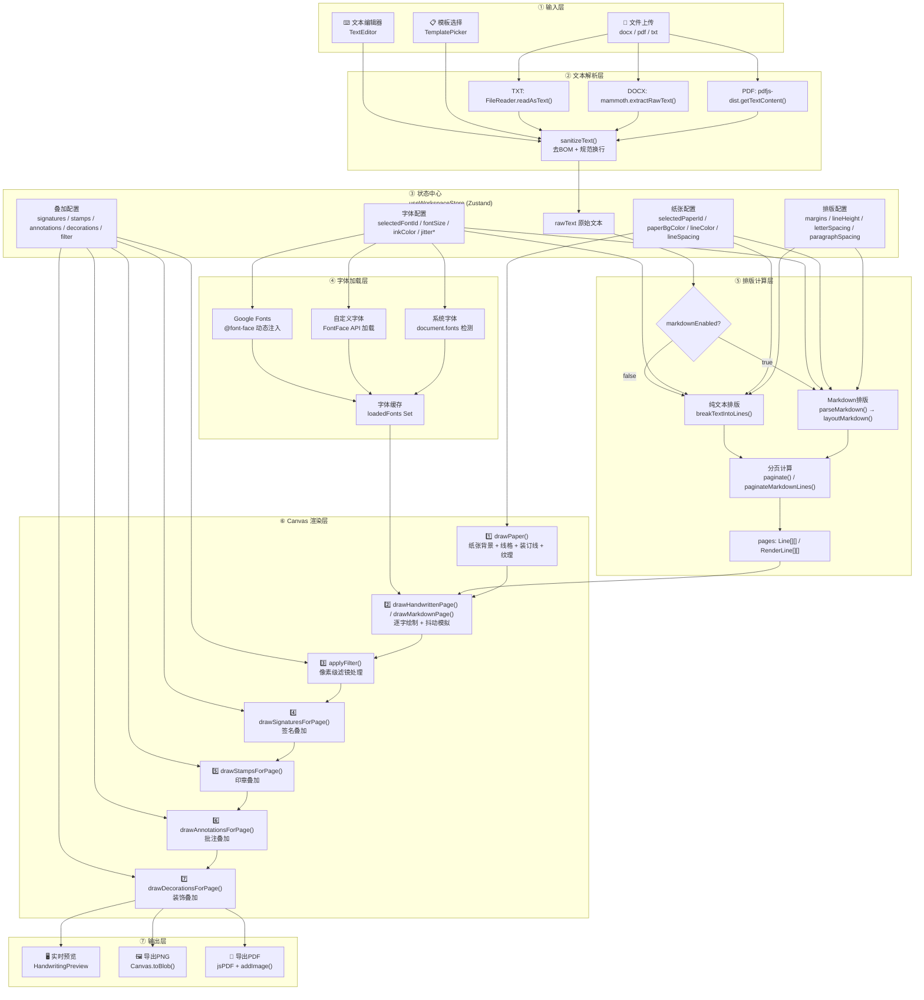

---

## 二、核心渲染管线详解

### 2.1 文本输入 → 纯文本提取

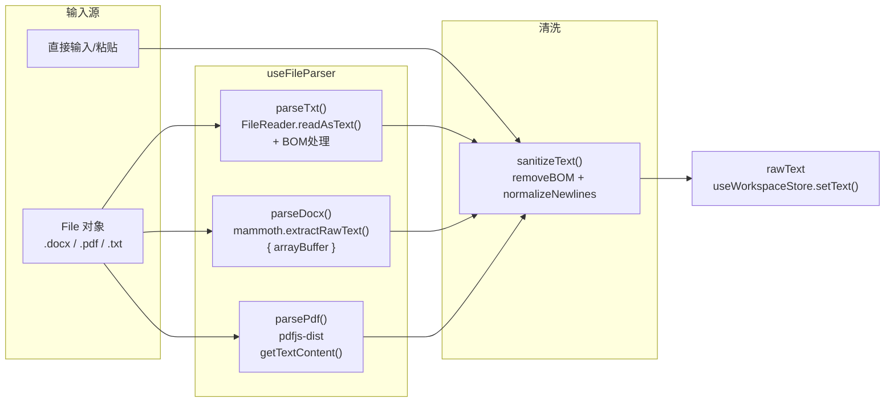

**关键源码**：
- [useFileParser.ts](file:///Volumes/ExMac/traeProject/全站1/yq-33/src/hooks/useFileParser.ts#L1-L107) — 文件解析入口
- [textUtils.ts → sanitizeText()](file:///Volumes/ExMac/traeProject/全站1/yq-33/src/utils/textUtils.ts#L14-L16) — 文本清洗

---

### 2.2 字体加载管线

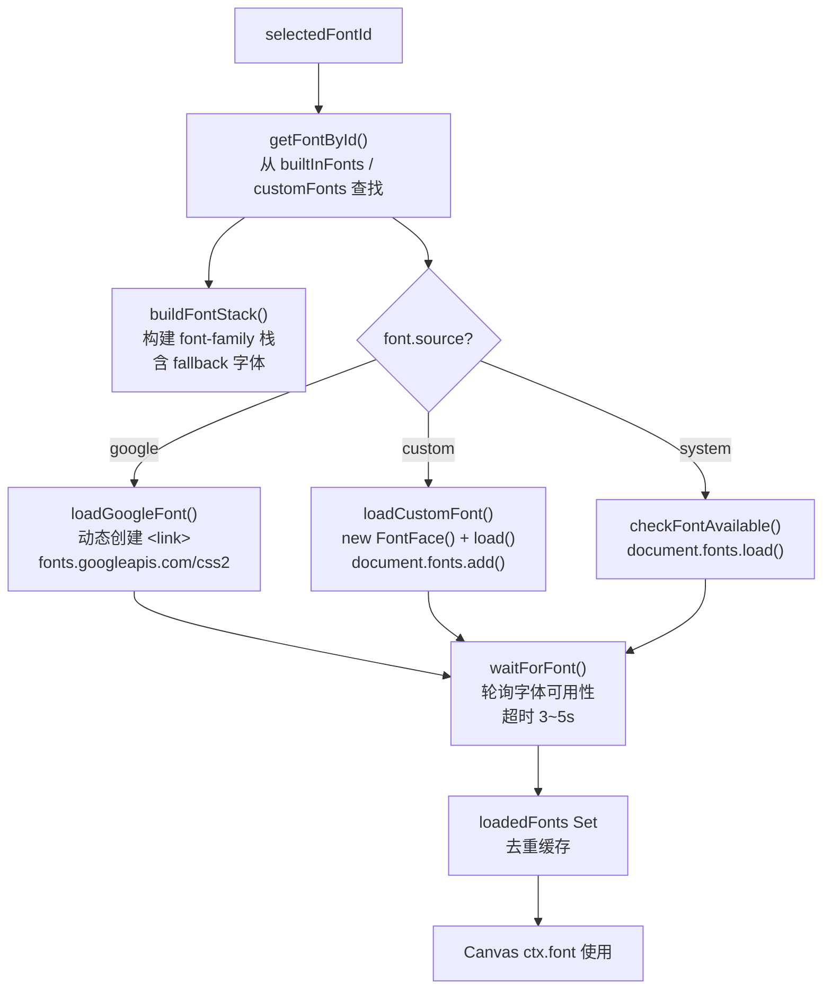

**关键源码**：
- [fontLoader.ts](file:///Volumes/ExMac/traeProject/全站1/yq-33/src/utils/fontLoader.ts#L1-L143) — 字体加载核心逻辑
- [fontPresets.ts → buildFontStack()](file:///Volumes/ExMac/traeProject/全站1/yq-33/src/utils/fontPresets.ts) — 字体栈构建

---

### 2.3 排版计算双通道

系统根据 `markdownEnabled` 标志选择两条排版路径：

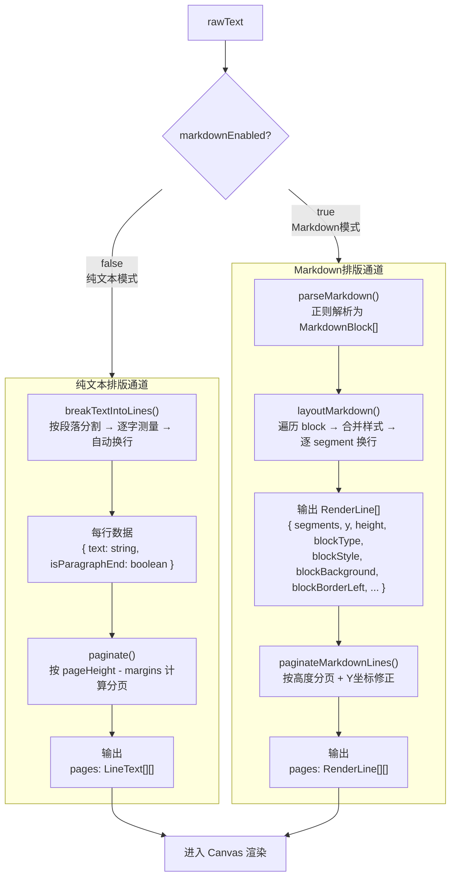

**纯文本排版数据流**：
1. [breakTextIntoLines()](file:///Volumes/ExMac/traeProject/全站1/yq-33/src/hooks/useHandwritingRender.ts#L171-L214) — 使用离屏 Canvas `measureText()` 逐字测量宽度
2. [paginate()](file:///Volumes/ExMac/traeProject/全站1/yq-33/src/hooks/useHandwritingRender.ts#L216-L238) — 按 `availableH` / `lineH` / `paragraphGap` 分页

**Markdown排版数据流**：
1. [parseMarkdown()](file:///Volumes/ExMac/traeProject/全站1/yq-33/src/utils/markdown/parser.ts#L94-L210) — 正则解析 `# 标题` / `> 引用` / `- 列表` / `**加粗**` 等语法 → `MarkdownBlock[]`
2. [layoutMarkdown()](file:///Volumes/ExMac/traeProject/全站1/yq-33/src/utils/markdown/markdownRenderer.ts#L147-L266) — 为每个 block 合并样式（[defaultMarkdownStyles](file:///Volumes/ExMac/traeProject/全站1/yq-33/src/utils/markdown/styles.ts#L3-L173)），按 segment 换行，产出 `RenderLine[]`
3. [paginateMarkdownLines()](file:///Volumes/ExMac/traeProject/全站1/yq-33/src/utils/markdown/markdownRenderer.ts#L268-L311) — 按 `pageHeight - margins` 分页，修正每页 Y 坐标偏移

---

### 2.4 Canvas 渲染七层叠加

每次渲染按严格顺序叠加 7 层内容：

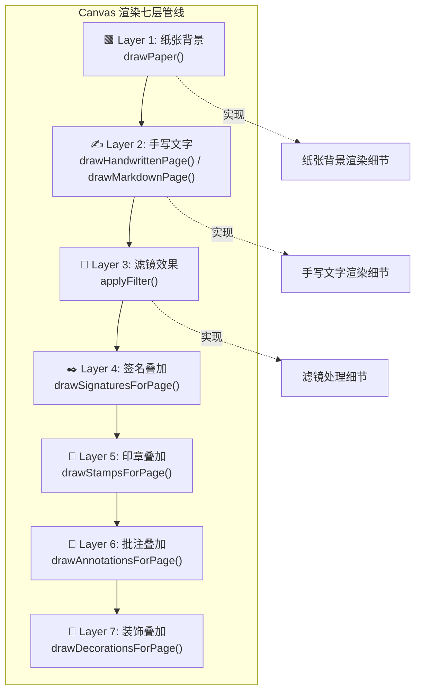

#### Layer 1: 纸张背景渲染

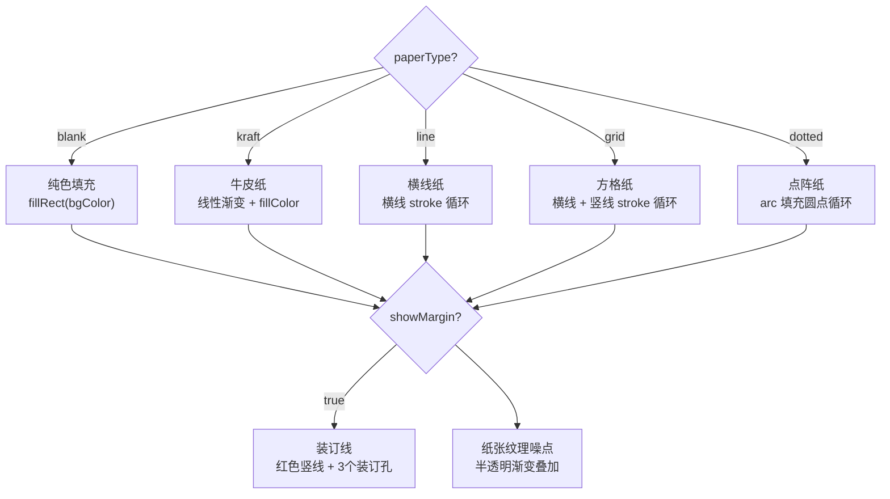

#### Layer 2: 手写文字渲染（核心）

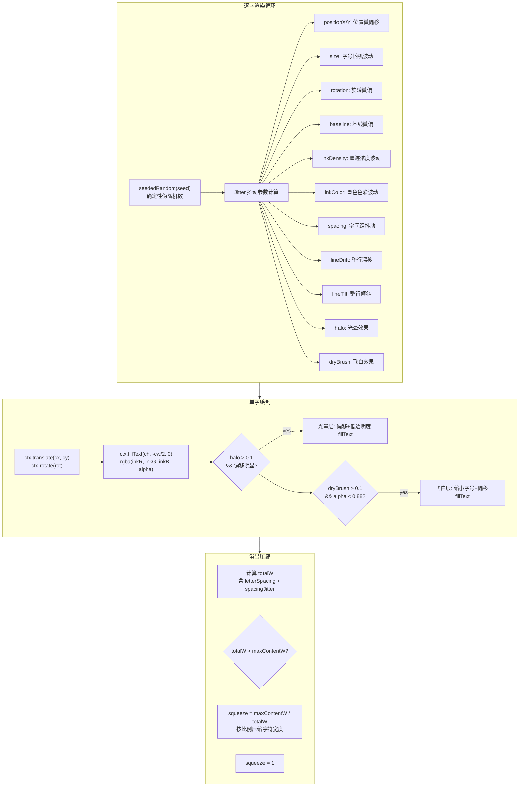

**关键机制**：
- [seededRandom()](file:///Volumes/ExMac/traeProject/全站1/yq-33/src/hooks/useHandwritingRender.ts#L20-L27) — 确定性伪随机数生成器，同页同位置始终产生相同抖动，保证渲染稳定性
- 12 个 Jitter 参数独立控制不同维度的手写模拟
- **光晕效果**：当字有旋转或位移时，叠加一层低透明度偏移文字模拟墨迹扩散
- **飞白效果**：当墨迹透明度较低时，叠加一层缩小字号的偏移文字模拟干笔效果
- **溢出压缩**：当行宽超出内容区时，按比例压缩避免越界

#### Layer 3: 滤镜效果

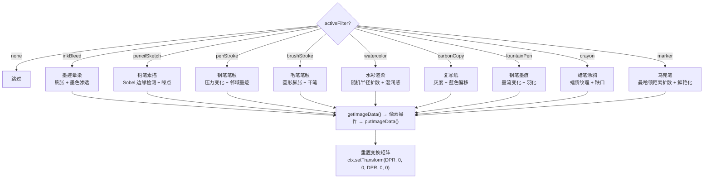

**关键源码**：[filterEffects.ts](file:///Volumes/ExMac/traeProject/全站1/yq-33/src/utils/filterEffects.ts#L1-L449) — 所有滤镜均为像素级操作，基于 `getImageData()` / `putImageData()`

---

### 2.5 叠加层渲染

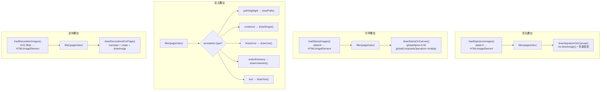

---

## 三、状态驱动渲染的数据流

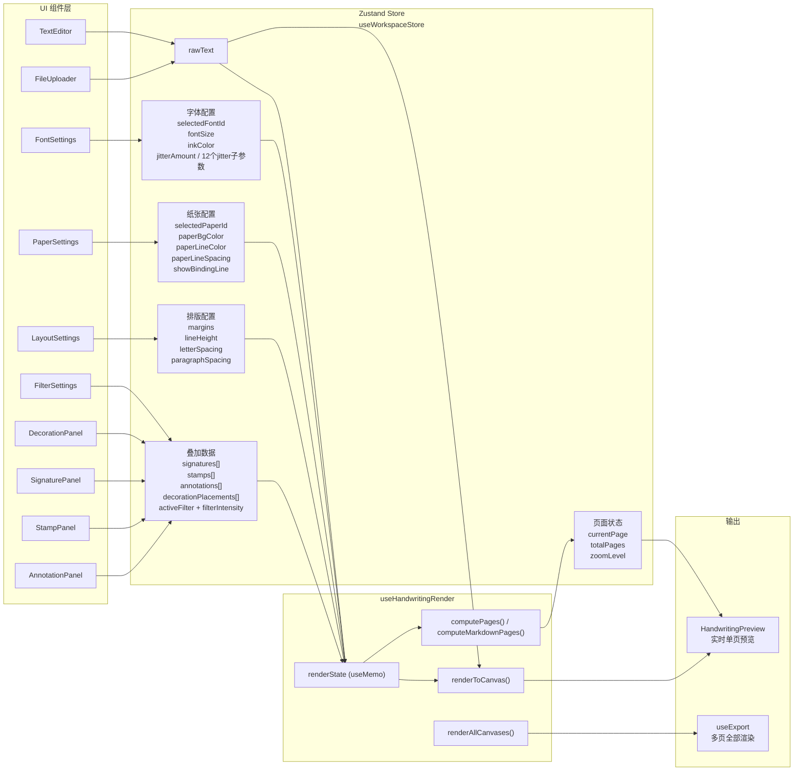

**响应式更新机制**：
- Store 任意字段变更 → Zustand 触发订阅更新
- [useHandwritingRender](file:///Volumes/ExMac/traeProject/全站1/yq-33/src/hooks/useHandwritingRender.ts#L426-L774) 通过 `useMemo` 派生 `renderState`
- `renderToCanvas` 被包裹在 `useCallback` 中，依赖 `renderState` + `rawText` + 所有 overlay 数据
- `useEffect` 监听 `renderToCanvas` 变化 + `currentPage` → 自动重绘 Canvas

---

## 四、渲染触发与执行流

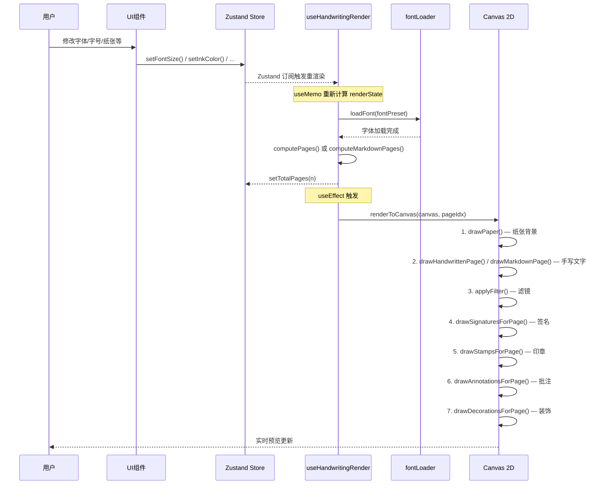

---

## 五、导出数据流

```mermaid
flowchart TB
    subgraph EXPORT_PNG["导出 PNG"]
        PNG_1["renderAllCanvases()<br/>遍历所有页"]
        PNG_2["每页创建离屏 Canvas<br/>完整7层渲染"]
        PNG_3["canvas.toBlob('image/png')"]
        PNG_4["a.download 触发下载<br/>手写字_文件名_第N页.png"]
    end

    subgraph EXPORT_PDF["导出 PDF"]
        PDF_1["renderAllCanvases()<br/>遍历所有页"]
        PDF_2["每页创建离屏 Canvas<br/>完整7层渲染"]
        PDF_3["canvas.toDataURL('image/jpeg', 0.92)"]
        PDF_4["new jsPDF({ unit: 'px', format: [w, h] })"]
        PDF_5["逐页 addPage() + addImage()"]
        PDF_6["pdf.save()"]
    end

    PNG_1 --> PNG_2 --> PNG_3 --> PNG_4
    PDF_1 --> PDF_2 --> PDF_3 --> PDF_4 --> PDF_5 --> PDF_6
```

**关键源码**：[useExport.ts](file:///Volumes/ExMac/traeProject/全站1/yq-33/src/hooks/useExport.ts#L1-L122)

---

## 六、完整数据流图（压缩版）

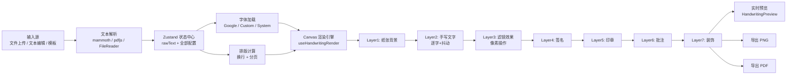

---

## 七、关键数据结构

| 数据结构 | 定义位置 | 用途 |
|----------|---------|------|
| `WorkspaceState` | [useWorkspaceStore.ts](file:///Volumes/ExMac/traeProject/全站1/yq-33/src/store/useWorkspaceStore.ts#L150-L296) | 全局状态，包含所有渲染参数 |
| `RenderState` | [useHandwritingRender.ts#L53-L73](file:///Volumes/ExMac/traeProject/全站1/yq-33/src/hooks/useHandwritingRender.ts#L53-L73) | 渲染时使用的聚合状态 |
| `JitterParams` | [useHandwritingRender.ts#L37-L51](file:///Volumes/ExMac/traeProject/全站1/yq-33/src/hooks/useHandwritingRender.ts#L37-L51) | 12维抖动参数集合 |
| `CharDrawInfo` | [useHandwritingRender.ts#L250-L265](file:///Volumes/ExMac/traeProject/全站1/yq-33/src/hooks/useHandwritingRender.ts#L250-L265) | 单字绘制的全部计算结果 |
| `MarkdownBlock` | [markdown/types.ts](file:///Volumes/ExMac/traeProject/全站1/yq-33/src/utils/markdown/types.ts#L52-L59) | Markdown 解析后的块结构 |
| `RenderLine` | [markdown/markdownRenderer.ts#L6-L27](file:///Volumes/ExMac/traeProject/全站1/yq-33/src/utils/markdown/markdownRenderer.ts#L6-L27) | Markdown 排版后的渲染行 |
| `Annotation` | [useWorkspaceStore.ts#L105](file:///Volumes/ExMac/traeProject/全站1/yq-33/src/store/useWorkspaceStore.ts#L105) | 批注联合类型 |
| `DecorationPlacement` | [types/index.ts#L15-L25](file:///Volumes/ExMac/traeProject/全站1/yq-33/src/types/index.ts#L15-L25) | 装饰放置位置信息 |

---

## 八、性能优化关键点

1. **确定性随机数** — [seededRandom()](file:///Volumes/ExMac/traeProject/全站1/yq-33/src/hooks/useHandwritingRender.ts#L20-L27) 保证同页同位置抖动一致，避免重绘闪烁
2. **离屏Canvas测量** — [breakTextIntoLines()](file:///Volumes/ExMac/traeProject/全站1/yq-33/src/hooks/useHandwritingRender.ts#L171-L214) 使用独立 Canvas 做文字测量，不干扰主渲染
3. **DPR=2 高清渲染** — Canvas 物理尺寸 = 逻辑尺寸 × 2，`setTransform` 统一缩放
4. **字体加载去重** — [loadedFonts Set](file:///Volumes/ExMac/traeProject/全站1/yq-33/src/utils/fontLoader.ts#L3) + [loadingPromises Map](file:///Volumes/ExMac/traeProject/全站1/yq-33/src/utils/fontLoader.ts#L4) 避免重复加载
5. **图片预加载缓存** — 签名/印章/装饰图片通过 Promise 预加载到内存，渲染时直接 drawImage
6. **useMemo/useCallback** — renderState 和核心函数均做缓存，减少无效重计算
7. **滤镜在文字层之后、叠加层之前** — 避免对签名/印章等叠加元素误施滤镜
